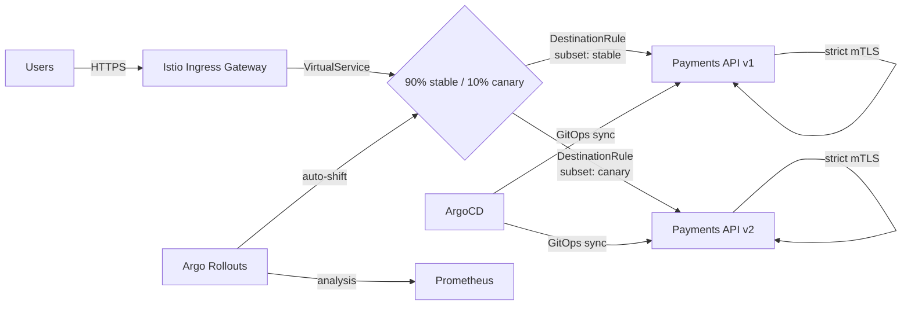

# Sesh — Platform Engineering Demo

Local Kubernetes stack with ArgoCD, Istio, and canary rollouts. Built to show platform engineering skills without spending cloud money.

> **Status**: Runs locally on kind. See [docs/local-setup.md](docs/local-setup.md)

## Architecture



| Layer | Technology | Purpose |
|-------|-----------|---------|
| Ingress | Istio Gateway + VirtualService | HTTPS termination, traffic splitting |
| Service Mesh | Istio + strict mTLS | Encrypted inter-pod traffic, retries, timeouts |
| Workload | Argo Rollout | Progressive canary delivery with automated rollback |
| GitOps | ArgoCD | Declarative continuous delivery from Git |
| Infra | Terraform / kind | IaC for EKS or local clusters |

## Project Structure

```
.
├── kind/                       # kind (local Kubernetes) cluster config
├── terraform/                  # Infrastructure as Code (AWS EKS)
│   ├── modules/eks/           # Reusable EKS module
│   └── environments/dev/      # Dev environment configuration
├── apps/                       # Application source code
│   └── payments-api/        # Sample Go microservice
├── helm-charts/               # Helm charts for Kubernetes apps
│   ├── microservice/          # Payments API Helm chart
│   ├── argocd-bootstrap/      # ArgoCD ApplicationSet manifests
│   └── argo-rollouts/         # Canary rollout configuration
├── istio/                     # Istio service mesh manifests
│   ├── gateways/              # Ingress gateways
│   ├── virtual-services/      # Traffic routing rules
│   └── destination-rules/     # Traffic policies / subsets
├── scripts/                   # Helper scripts
│   ├── setup-kind.sh          # kind setup
│   ├── teardown-kind.sh       # kind teardown
│   ├── deploy.sh              # AWS deploy
│   ├── teardown.sh            # AWS teardown
│   ├── demo-self-healing.sh   # self-healing demo
│   └── demo-canary.sh         # canary demo
└── docs/                      # Architecture diagrams & runbooks
```

## Quick Start — Local

### macOS / Linux / Git Bash

```bash
# 1. Install prerequisites: Docker, kind, kubectl, istioctl, helm
#    See docs/local-setup.md for links

# 2. One-command setup
make kind-up

# 3. Access ArgoCD UI
kubectl port-forward svc/argocd-server -n argocd 8080:443
# Login: admin / $(make argocd-password)

# 4. Test the payments API
kubectl port-forward svc/payments-api -n payments 8083:8080
curl http://localhost:8083/health

# 5. Run demos
make demo-self-healing
make demo-canary

# 6. Tear down
make kind-down
```

### Windows (PowerShell)

```powershell
# 1. Install prerequisites: Docker Desktop, kind, kubectl, istioctl, helm
#    See docs/windows-setup.md for links

# 2. One-command setup
.\scripts\setup-kind.ps1

# 3. Access ArgoCD UI
kubectl port-forward svc/argocd-server -n argocd 8080:443
# Login: admin / Password: kubectl -n argocd get secret argocd-initial-admin-secret -o jsonpath="{.data.password}" | %{ [Convert]::FromBase64String($_) } | %{ [Text.Encoding]::UTF8.GetString($_) }

# 4. Test the payments API
kubectl port-forward svc/payments-api -n payments 8083:8080
curl http://localhost:8083/health

# 5. Run demos
.\scripts\demo-self-healing.ps1
.\scripts\demo-canary.ps1

# 6. Tear down
.\scripts\teardown-kind.ps1
```

See [`docs/windows-setup.md`](docs/windows-setup.md) for detailed troubleshooting.

## AWS EKS (optional)

```bash
cd terraform/environments/dev
terraform init
terraform apply

aws eks update-kubeconfig --region us-east-1 --name platform-dev
bash scripts/deploy.sh
```

## Demos

Self-healing — delete a pod and watch it respawn:
```bash
kubectl delete pod -l app=payments-api -n payments --wait=false
```

Canary — re-tag and patch the rollout:
```bash
docker tag localhost:5001/payments-api:v1.0.0 localhost:5001/payments-api:v2.0.0
docker push localhost:5001/payments-api:v2.0.0
kind load docker-image localhost:5001/payments-api:v2.0.0 --name platform-local
kubectl patch rollout payments-api -n payments --type='json' -p='[{"op": "replace", "path": "/spec/template/spec/containers/0/image", "value": "localhost:5001/payments-api:v2.0.0"}]'
kubectl get pods -n payments -w
```
